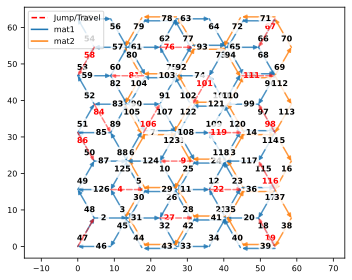
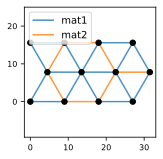
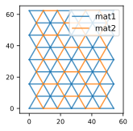
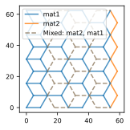

# Print Path Planning for (Multi)Material Structures

A **Rural Postman Problem (RPP)** solver for the **Multimaterial Printing Path Planning Problem (MMPPP)**. Given a multimaterial lattice and a set of per-material nozzle offsets, it plans a continuous toolpath that prints every edge while minimizing wasted travel, then exports ready-to-run (Aerotech A3200-style) G-code. It alo works for single-material lattices as a special case of multimaterial lattices. 

<p align="center">
  
</p>

> **Associated paper:** *Print Path Planning and Nozzle Offset Design for Multimaterial Lattices*, Z. Li and J. Mueller. [Paper](https://doi.org/10.1080/17452759.2026.2694273)

---

## Overview

Multimaterial direct-ink-writing and similar extrusion processes deposit material along the edges of a lattice. Printing efficiently means traversing every required edge with as little non-printing travel ("jumps") as possible — a variant of the classic undirected [Rural Postman Problem](https://en.wikipedia.org/wiki/Arc_routing#Rural_postman_problem). This tool implements the full pipeline:

1. **Unit cell** — define nodes and material-tagged edges for a single repeating cell.
2. **Lattice** — tessellate the cell into an `n_x × n_y` grid, optionally adding positional noise, randomizing materials, and cropping to a boundary.
3. **Mixed lattice** — apply a spatial nozzle offset per material so that physically distinct nozzles in one toolhead are accounted for; overlapping edges become multi-material edges.
4. **Toolpath** — solve the RPP to produce a single continuous, near-optimal path.
5. **Visualize & export** — render the path / per-material activity / 3D layers, and export G-code.

<p align="center">
  
  
  
  
</p>
<p align="center"><em>Unit cell → tessellated lattice → mixed lattice (nozzle offsets) → solved toolpath</em></p>

## Features

- Multimaterial **unit cells** with automatic, distinct per-material colors.
- **Tessellation** with auto or explicit translation vectors and rectangular boundary cropping.
- Optional **positional noise** and **material randomization** (shuffle or sample modes) for studying robustness.
- **Per-material nozzle offsets** producing a multi-material edge graph.
- **RPP solver** (`solve`) using odd-degree matching, component merging via edge swapping / PCA, an Eulerian circuit, and open-path optimization. An alternative Frederickson MST mode is available (`use_mst=True`).
- **Baseline planners** for comparison: `solve_random`, `solve_greedy`, `solve_line`.
- **Visualization**: 2D route with direction arrows, per-material paths, 3D layer views, animation frames, and a valve-activity-over-time timeline.
- **G-code export** in an Aerotech A3200-style dialect with configurable speeds, layer counts, and dwell times.

## Repository structure

```
.
├── rpp_mmppp.py        # All classes + a runnable demo under __main__
├── README.md
├── LICENSE             # MIT
├── CITATION.cff        # "Cite this repository" metadata
├── requirements.txt    # Pinned dependencies
├── .gitignore
└── docs/
    └── images/         # Example output figures used in this README
```

Running the script creates an `RPP_output/` folder (git-ignored) containing `figs/`, `data/`, and `visualization/` subfolders.

## Installation

Tested with **Python 3.11.5**. Dependencies: `networkx==3.4.2`, `numpy`, `matplotlib`, `scipy`.

**Using conda (recommended):**

```powershell
conda create -n mmppp python=3.11
conda activate mmppp
pip install -r requirements.txt
```

> The original development environment is the conda `base` env. If your packages already live there, simply `conda activate base` instead of creating a new env.

**Using pip / venv:**

```bash
python -m venv .venv
source .venv/bin/activate          # Windows: .venv\Scripts\activate
pip install -r requirements.txt
```

> **Why pin `networkx==3.4.2`?** NetworkX versions older than 3.1 can order edges differently at even-degree vertices, which changes the *geometry* of the path (though not its total cost). Pinning keeps results reproducible.

## Quick start

Activate your environment, set a fixed hash seed (see the note below), and run the script:

**Windows PowerShell**

```powershell
conda activate base
$env:PYTHONHASHSEED = 12
python rpp_mmppp.py
```

**macOS / Linux**

```bash
conda activate base
PYTHONHASHSEED=12 python rpp_mmppp.py
```

> **Reproducibility note.** Some graph operations depend on Python's hash randomization. Set `PYTHONHASHSEED` to a fixed value (e.g. `12`) before running to obtain a deterministic, reproducible toolpath. Without it the resulting path geometry may vary run to run (the total path length stays the same).

By default the script runs example **case 2** (a multi-material lattice). To run a different example, edit the `__main__` block — see [Reproducing the example cases](#reproducing-the-example-cases).

## Outputs

After a run, `RPP_output/` contains:

| Path | Description |
| --- | --- |
| `figs/Fig1_unitCell.svg` | The input unit cell |
| `figs/Fig2_lattice.svg` | The tessellated lattice |
| `figs/mixed_lattice.svg` | Lattice after per-material nozzle offsets |
| `figs/RPP_solution.svg` | The solved toolpath with direction arrows |
| `figs/material_status_timeline.svg` | Per-material valve on/off over time |
| `figs/debug_*.svg` | Intermediate solver steps (only when `debug=True`) |
| `data/toolpath.json` | The toolpath as a list of steps (print/travel, endpoints, materials, weights) |
| `data/GCode.gcode` | Exported Aerotech A3200-style G-code |
| `visualization/` | 3D layer / per-material / animation-frame renders (when those calls are enabled) |

The console also prints a summary: total steps, number of jumps, jump distance, print distance, and total path distance.

## Defining your own structure

`rpp_mmppp.py` can be imported as a module. A minimal end-to-end example:

```python
from rpp_mmppp import UnitCell, Lattice, MixedLattice, RuralPostmanSolver, ToolpathVisualizer

# 1. Unit cell: nodes (x, y) and material-tagged edges [node_u, node_v, material]
cell = UnitCell()
for x, y in [[0, 0], [12, 0], [12, 12], [0, 12]]:
    cell.add_node(x, y)
cell.add_connections([
    [0, 1, 'mat1'],
    [1, 2, 'mat1'],
    [2, 3, 'mat1'],
    [0, 3, 'mat1'],
])

# 2. Tessellate into an n_x by n_y lattice (tes_x / tes_y are the tile pitch)
lattice = Lattice(unit_cell=cell, n_x=4, n_y=4, tes_x=24, tes_y=24)

# Optional experiments:
# lattice.apply_noise(2, seed=42)                                   # jitter node positions
# lattice.randomize_materials({'mat1': 0.5, 'mat2': 0.5}, seed=42)  # sample materials per edge

# 3. Apply a nozzle offset per material -> mixed lattice
offsets = {'mat1': [0.0, 0.0]}
mixed = MixedLattice.from_lattice_with_offsets(lattice, offsets)

# 4. Solve the Rural Postman Problem for a continuous toolpath
solver = RuralPostmanSolver(mixed)
toolpath = solver.solve(start_coords=[0.0, 0.0])      # or use_mst=True for the MST variant
solver.visualize_route(save_path='RPP_solution.svg')

# 5. Visualize activity and export G-code
viz = ToolpathVisualizer(toolpath, material_offsets=offsets,
                         lift_distance=5.0, layer_thickness=0.8)
viz.export_to_gcode('output.gcode', layer_height=0.8, num_layers=8,
                    printing_speed=20.0, traveling_speed=40.0)
```

For multiple materials, give each one its own offset, e.g. `offsets = {'mat1': [0.0, 0.0], 'mat2': [0.5 * L, 0.0]}`.

### Baseline planners (for comparison)

Swap `solver.solve(...)` for any of these to compare against the RPP solution:

```python
toolpath = solver.solve_random(seed=42, start_coords=[0.0, 0.0])   # random edge order
toolpath = solver.solve_greedy(start_coords=[0.0, 0.0])            # nearest-edge greedy
toolpath = solver.solve_line(start_coords=[0.0, 0.0])             # greedy, preferring straight runs
```

## Reproducing the example cases

The `__main__` block of `rpp_mmppp.py` contains a labeled gallery of example unit cells (`case 0` through `case 8`) between the `# ---------sample cases----------` markers. All but one are commented out. To reproduce a specific case:

1. Comment out the currently active case block.
2. Uncomment the case you want (each defines `nodes`, `edges`, `nX`, `nY`, `tesX`, `tesY`, and `offsets`).
3. Re-run with a fixed `PYTHONHASHSEED` as shown in [Quick start](#quick-start).

Toggle `debug = True` (top of `__main__`) to emit the intermediate solver-step figures, and `use_mst = True` to use the Frederickson MST variant instead of the default algorithm.

## Algorithm overview

The default solver (`solve`) proceeds as follows:

1. **Odd-degree matching** — find odd-degree vertices and add a biased local matching so every vertex has even degree.
2. **Component merging** — if the graph is disconnected, merge components first by edge swapping, then by a PCA-guided connection sweep. (With `use_mst=True`, components are instead connected by a minimum spanning tree à la Frederickson, then odd nodes are matched.)
3. **Eulerian circuit** — traverse the now-Eulerian graph to get a closed route.
4. **Open-path optimization** — rotate and cut the circuit so it starts at the requested `start_coords`, minimizing the entry jump.

The `ToolpathVisualizer` then computes timing (using the print/travel speeds and dwell times) and emits G-code.

## How to cite

This software accompanies a manuscript that is **currently under revision, to be updated soon**:

> Li, Z., & Mueller, J. (2026). Print path planning and nozzle offset design for multimaterial lattices. Virtual and Physical Prototyping, 21(1). https://doi.org/10.1080/17452759.2026.2694273


Full publication details (journal, volume, DOI) will be added here once available. GitHub's "Cite this repository" button uses [`CITATION.cff`](CITATION.cff).

## License

Released under the [MIT License](LICENSE).

## Authors

- [**Zefang Li**](https://zefangli.github.io/) — PhD Candidate, Johns Hopkins University
- [**Jochen Mueller**](https://engineering.jhu.edu/faculty/jochen-mueller/) — Assistant Professor, Johns Hopkins University

Developed in the [Mueller Lab](https://muellerlab.com/) at Johns Hopkins University.
